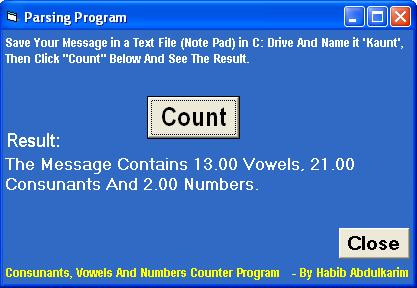



## PARSING PROGRAM

### Description

This Program Reads a text File and analyses all the data in the file. It then tells you how many Consunants, Vowels And Numbers are in the File. It Helps teach many string manipulations. Some noted observations have been corrected. Thanks for your various observations.
 
### More Info
 

             |
---                |---
**Submitted On**   |2007-11-09 16:18:54
**By**             |[Habib Abdulkarim Kwami](https://github.com/Planet-Source-Code/PSCIndex/blob/master/ByAuthor/habib-abdulkarim-kwami.md)
**Level**          |Beginner
**User Rating**    |4.5 (18 globes from 4 users)
**Compatibility**  |VB 6\.0
**Category**       |[String Manipulation](https://github.com/Planet-Source-Code/PSCIndex/blob/master/ByCategory/string-manipulation__1-5.md)
**World**          |[Visual Basic](https://github.com/Planet-Source-Code/PSCIndex/blob/master/ByWorld/visual-basic.md)
**Archive File**   |[PARSING\_PR20911111162007\.ZIP](https://github.com/Planet-Source-Code/habib-abdulkarim-kwami-parsing-program__1-69600/archive/master.zip)

